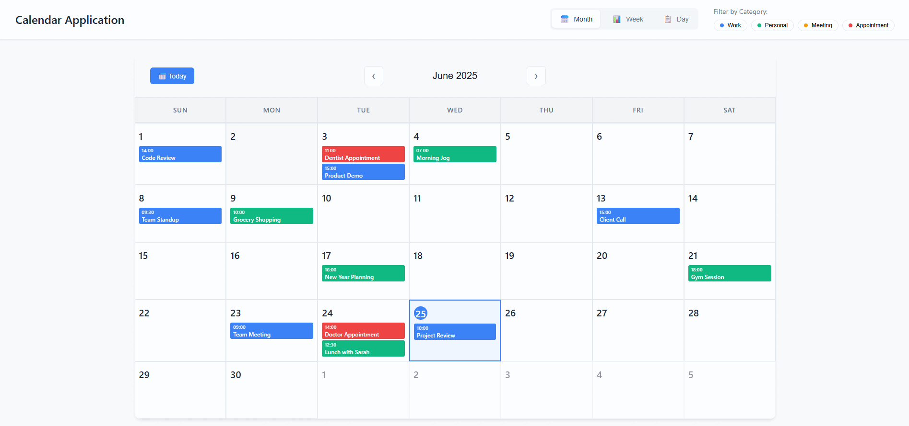
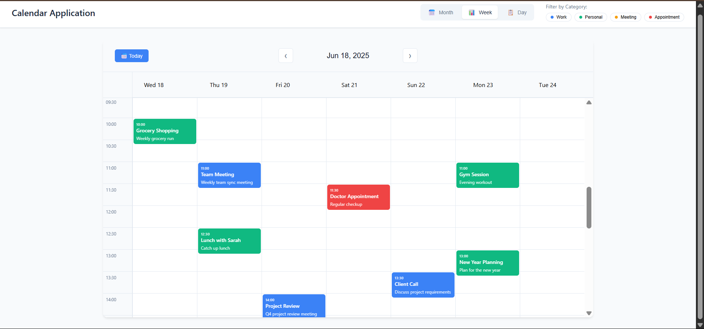
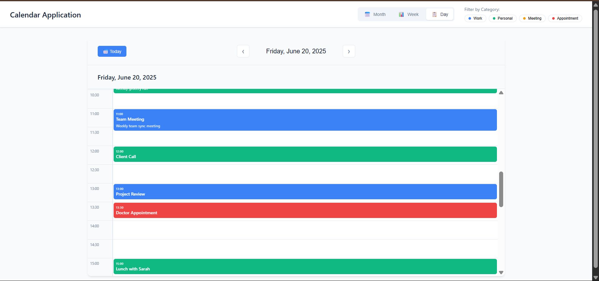
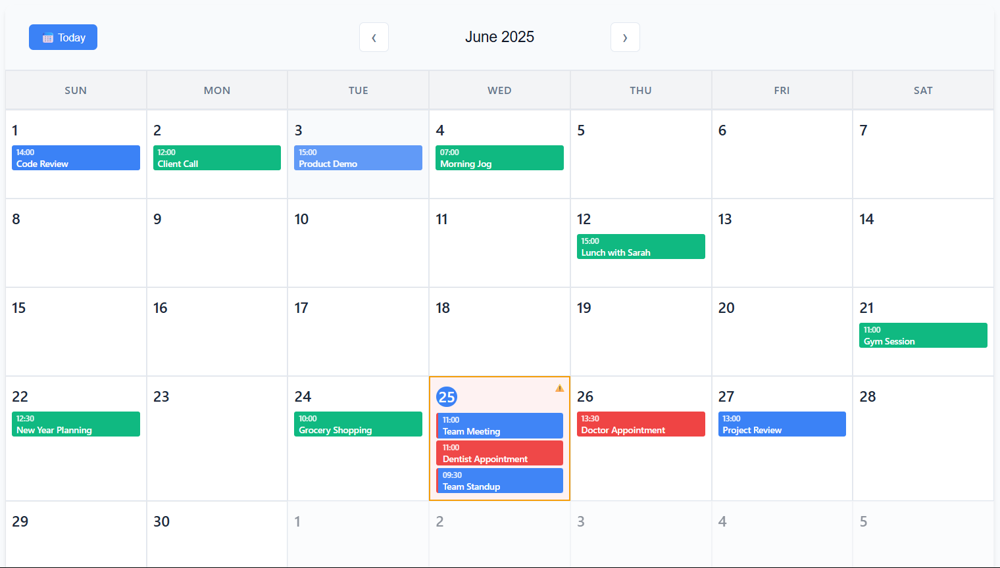

# Calendar App

A modern, interactive calendar application built with React that allows users to manage events, appointments, and schedules with an intuitive user interface.

## Features

- 📅 **Monthly Calendar View** - Navigate through months with a clean, responsive grid layout
- ➕ **Event Management** - Add, edit, and delete events with ease
- 🎨 **Color-coded Events** - Organize events with different colors and categories
- 📱 **Responsive Design** - Works seamlessly on desktop, tablet, and mobile devices
- 🔍 **Event Details** - Click on events to view detailed information
- 🗓️ **Date Navigation** - Quick navigation between months and years

## Demo

[Live Demo] (https://karthikeyan-2004.github.io/Calendar/)

## Screenshots



Week View



Day View



Conflict Highlighting




## Usage

### Adding Events
1. Click on any date in the calendar
2. Fill in the event details (title, time, description, category)
3. Choose a category for your event
4. Click "Save" to add the event

### Editing Events
1. Click on an existing event
2. Modify the event details in the popup
3. Click "Update" to save changes

### Deleting Events
1. Click on the event you want to delete
2. Click the "Delete" button in the event details popup

### Navigation
- Use the arrow buttons to navigate between months
- Click on the month/year header to quickly jump to a specific date

## Project Structure

```
Calendar/
├── public/
│   ├── index.html
│   └── favicon.ico
├── src/
│   ├── components/
|   │   ├──views/
|   │   │   ├── MonthView.jsx
|   │   │   ├── WeekView.jsx
|   │   │   ├── DayView.jsx
|   │   │   ├── MonthView.css
│   │   ├── Calendar.jsx
│   │   ├── EventModal.jsx
│   │   ├── EventItem.jsx
│   │   ├── CalendarHeader.jsx
│   │   ├── FilterPanel.jsx
│   │   ├── ViewSelector.jsx
│   │   └── CalendarHeader.css
│   │   └── Calendar.css
│   ├── utils/
│   │   └── eventUtils.js
|   |   └── helpers.js
│   ├── data/
│   │   └── events.js
│   ├── App.js
│   ├── App.css
│   └── index.js
├── package.json
└── README.md
```

## Technologies Used

- **React** - Frontend framework
- **JavaScript (ES6+)** - Programming language
- **CSS3** - Styling and animations
- **HTML5** - Markup structure


## Future Enhancements

- [ ] Integration with Google Calendar API
- [ ] Event reminders and notifications
- [ ] Recurring events support
- [ ] Export calendar to different formats (PDF, ICS)
- [ ] Multi-language support
- [ ] Event sharing functionality
- [ ] Calendar sync across devices

## Getting Started

### Prerequisites

Make sure you have the following installed on your system:
- [Node.js](https://nodejs.org/) (version 14.0 or higher)
- [npm](https://www.npmjs.com/) (comes with Node.js)

### Installation

1. Clone the repository:
```bash
git clone https://github.com/Karthikeyan-2004/Calendar.git
```

2. Navigate to the project directory:
```bash
cd Calendar
```

3. Install dependencies:
```bash
npm install
```

4. Start the development server:
```bash
npm start
```

5. Open your browser and visit [http://localhost:3000](http://localhost:3000)

## Available Scripts

In the project directory, you can run:

### `npm start`
Runs the app in development mode. The page will reload when you make changes.

### `npm test`
Launches the test runner in interactive watch mode.

### `npm run build`
Builds the app for production to the `build` folder. The build is minified and optimized for best performance.

### `npm run eject`
**Note: This is a one-way operation. Once you eject, you can't go back!**

## Author

**Karthikeyan** - [GitHub Profile](https://github.com/Karthikeyan-2004)


## Support

If you found this project helpful, please give it a ⭐ on GitHub!

For support, email karthikeyanranganathan731@gmail.com or create an issue in the GitHub repository.
